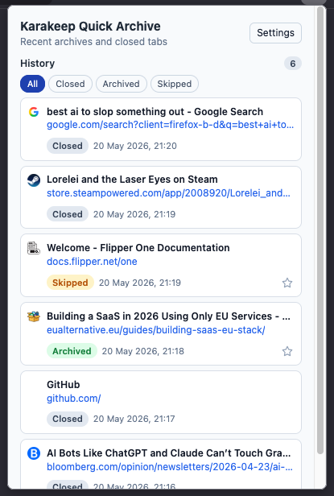

# Karakeep Quick Archive

A Firefox extension that archives the current tab to a self-hosted
[Karakeep](https://karakeep.app/) instance with a single keystroke, then
closes the tab. Designed to make "archive this tab" feel as cheap as
"close this tab".

## Features

- **One-shortcut archive**: press `Cmd+Alt+W` (macOS) or `Ctrl+Alt+W`
  (Windows/Linux) to send the current tab to Karakeep and close it
  immediately — no waiting on the network.
- **Compact popup** with three sections that hide themselves when empty:
  - **Processing** — archive requests still in flight.
  - **Manual Review** — failed archive or favourite-toggle attempts, with
    Retry / Mark closed / Dismiss controls.
  - **History** — recently closed, archived, and skipped tabs, filterable
    by All / Closed / Archived / Skipped.
- **Two-click promotions**: clicking the `Closed` badge on a history row
  flips it to `Archive?`; a second click sends the archive request.
  Clicking the history count flips it to `Clear?`; a second click clears
  the entries matching the active filter. Clicking elsewhere reverts.
- **Open in Karakeep**: archived and skipped history rows link directly
  to their bookmark in the Karakeep web UI.
- **Favourite toggle**: a star button on each archived/skipped row
  toggles the bookmark's favourited state in Karakeep. The state syncs
  across every history row that references the same bookmark.

## Screenshot



## Install

### Temporary load (development / one-off)

https://github.com/Zeromusta/karakeep-quick-archive-firefox/releases

## Configure

1. Click the Karakeep toolbar icon → **Settings**.
2. Enter your **Karakeep Base URL** (e.g. `https://karakeep.example.com`)
   and **API Key**. Generate an API key from your Karakeep account
   settings.
3. Click **Test connection**. Firefox will prompt for permission to
   access your Karakeep host the first time — grant it. A successful
   ping reports "Connection succeeded."
4. Click **Save settings**.

Other settings:

- **Request timeout (seconds)** — how long to wait on a Karakeep request
  before giving up. Default 15.
- **History retention (hours)** — how long resolved entries (Closed /
  Archived / Skipped) stay in the popup before being pruned. Default 50.
- **Max history items to render** — caps how many entries the popup
  shows even if more are retained. Default 500.
- **Show favicon in UI** — toggle favicons in row rendering.
- **Debug logging** — surface internal logs in the background page
  console (visible via `about:debugging` → Inspect on Karakeep Quick
  Archive).
- **Clear all history** — danger button at the bottom of the settings
  page wipes every history entry. Requires confirmation.

## Develop

```bash
npm test       # run the Node-based test suite (no install required)
```

Tests use Node's built-in `node:test` runner and live under `tests/`.
A `tests/helpers/browser-mock.js` stub provides the `browser.*` APIs
that the background and shared modules expect. No browser is launched.

Manual testing in a real Firefox happens via the temporary-load flow
above. Re-clicking **Reload** in `about:debugging` picks up file
changes without restarting Firefox.

## Architecture

```
manifest.json              # MV3 manifest; declares permissions, action,
                           # commands (Ctrl+Alt+W), icons.
background/
  controller.js            # Listener registration, message routing,
                           # archive command, idempotent init.
  archive-queue.js         # In-flight job tracking; resumes on startup.
  history-store.js         # Single source of truth for storage.local;
                           # serializes all writes behind a promise lock.
  karakeep-client.js       # POST /api/v1/bookmarks (archive) and
                           # PATCH /api/v1/bookmarks/{id} (favourite).
  tab-snapshot-cache.js    # In-memory map of currently open tabs,
                           # rehydrated from storage.session on wake.
  cleanup.js               # Alarm-driven history pruning.
popup/                     # Toolbar popup UI.
options/                   # Settings page.
shared/                    # Constants, utilities, JSDoc type defs.
tests/                     # Node-based tests + mock helpers.
icons/                     # PNG icons (light + dark theme variants).
```

## Releasing

Packaging, AMO signing, and the tag-driven GitHub Actions workflow
that publishes signed `.xpi`s plus an auto-update feed are documented
in [RELEASING.md](RELEASING.md).

## Credits

- Star icons from [Font Awesome Free 6](https://fontawesome.com/),
  licensed under [CC BY 4.0](https://creativecommons.org/licenses/by/4.0/).
- Built around the [Karakeep](https://karakeep.app/) self-hosted
  bookmarking API.
- My mate [Claude](https://claude.ai) who never groans when I ask him to change the padding.
