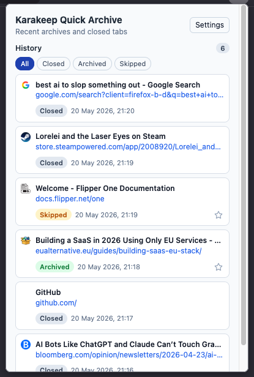

# Karakeep Quick Archive

A Firefox extension that archives the current tab to a self-hosted
[Karakeep](https://karakeep.app/) instance with a single keystroke, then
closes the tab. Designed to make "archive this tab" feel as cheap as
"close this tab".

## Features

- **One-shortcut archive**: press `Ctrl+Cmd+W` (macOS) or `Ctrl+Alt+W`
  (Windows/Linux) to send the current tab to Karakeep and close it
  after saving the live page state and screenshot locally. Resource downloads,
  archive assembly and uploads continue in the background.
- **Capture what Firefox can see**: bundles the rendered page with SingleFile,
  takes a screenshot of the visible viewport, and saves the page image as its
  banner (or uses the screenshot when no image is available). The toolbar shows
  **…** during the brief live capture. Keep the tab selected until it closes;
  slow image/style downloads no longer hold the tab open.
- **Capture fallback**: if the full snapshot fails, tries rendered text, then
  saves the URL. Partial captures and URL-only saves get the
  **capture-incomplete** tag in Karakeep; hover **Capture needs review** in the
  popup for the reason. Saving an already closed history entry is URL-only.
- **Archive into a list**: press `Ctrl+Cmd+E` (macOS) or `Ctrl+Alt+E`
  (Windows/Linux) to open a list picker over the current page (the page
  dims behind it). Pick **Favourites** or any manual Karakeep list by
  pressing `1`–`9` or clicking; the tab is archived into that list and
  closed. `Esc` or a click outside cancels.
- **Compact popup** with three sections that hide themselves when empty:
  - **Processing** — archive requests still in flight.
  - **Manual Review** — failed archive, favourite-toggle, or list-add
    attempts, with Retry / Mark closed / Dismiss controls.
  - **History** — recently closed, archived, and skipped tabs, filterable
    by All / Closed / Archived / Skipped.
- **Two-click promotions**: clicking the `Closed` badge on a history row
  flips it to `Archive?`; a second click sends the archive request.
  Clicking the history count flips it to `Clear?`; a second click clears
  the entries matching the active filter. Clicking elsewhere reverts.
- **Open in Karakeep**: archived and skipped history rows link directly
  to their bookmark in the Karakeep web UI.
- **Favourite & list controls**: each archived/skipped history row has a
  star button that toggles the bookmark's favourited state, and a list
  button that opens an inline picker to add or remove the bookmark from
  any manual Karakeep list (current membership is pre-checked). Favourite
  state syncs across every history row that references the same bookmark.

## Screenshot



## Install

https://github.com/Zeromusta/karakeep-quick-archive-firefox/releases

## Configure

1. Click the Karakeep toolbar icon → **Settings**.
2. Enter your **Karakeep Base URL** (e.g. `https://karakeep.example.com`)
   and **API Key**. Generate an API key from your Karakeep account
   settings.
3. Click **Test connection**. Firefox will prompt for permission to
   access your Karakeep host the first time — grant it. A successful
   ping reports "Connection succeeded."
4. Click **Save settings**.
5. Under **Page capture**, click **Allow complete page capture** and grant
   access. This lets the extension fetch images and styles from other hosts.
   Firefox may also ask you to accept the new content permissions when updating.
   Capture happens only when you choose Archive; page content goes to your
   configured Karakeep server. Logged-in page content can be included.

Other settings:

- **Request timeout (seconds)** — how long to wait on a Karakeep request
  before giving up. Default 15; snapshot/image requests allow at least 90
  seconds because their payloads are larger.
- **History retention (hours)** — how long resolved entries (Closed /
  Archived / Skipped) stay in the popup before being pruned. Default 50.
- **Max history items to render** — caps how many entries the popup
  shows even if more are retained. Default 500.
- **Show favicon in UI** — toggle favicons in row rendering.
- **Debug logging** — surface internal logs in the background page
  console (visible via `about:debugging` → Inspect on Karakeep Quick
  Archive).
- **Clear all history** — danger button at the bottom of the settings
  page wipes every history entry. Requires confirmation.

## Develop

Use Node.js 24 or later:

```bash
npm ci
npm run build        # bundle pinned SingleFile and copy its license
npm test             # unit/integration tests, including IndexedDB retries
npm run lint         # Firefox self-hosted extension validator
npm run test:browser # isolated Firefox profile and local mock Karakeep
```

The browser test requires Firefox (or `FIREFOX_BINARY`) and downloads a pinned
geckodriver on its first run. It uses generated fixture pages, no personal profile
or live API credentials. It checks rendered content under a strict CSP,
cross-origin resources, screenshots, banners, closing and fallback tagging.
It also deliberately delays resource downloads by three seconds and verifies
that the tab closes before those downloads finish.

To try the development build, open `about:debugging` → **This Firefox** →
**Load Temporary Add-on**, then choose this repository's `manifest.json` after
building. Rebuild and click **Reload** after changing capture code.

### Verify v1.4.1 with Karakeep

1. Update/install the signed XPI and grant the Page capture permission above.
2. Open the Tesco product URL, wait until the product is visible, and dismiss
   any cookie dialog you do not want in the screenshot.
3. Use the usual archive shortcut (or archive-to-list). Leave the tab selected
   while the toolbar badge spins; it closes once the local copy is persisted.
   The badge keeps spinning through background processing, then shows a green
   tick for two seconds. It resumes spinning if another archive is still active;
   overlapping completions do not queue or extend ticks.
   A capture or SingleFile upload fallback shows an amber **!** until you open
   the extension popup, even if other archives succeed in the meantime.
4. Wait for Processing to finish, then use **Open in Karakeep** in history.
   Check Reader view contains product details, the Precrawled Archive opens,
   Screenshot shows the product, and the bookmark has a banner.
5. Try a normal article and an archive-to-list/favourite save too. If a capture
   needs review, inspect its popup reason and the **capture-incomplete** tag.

Karakeep 0.33.2's SingleFile and asset APIs are the compatibility baseline.
Existing bookmarks receive a refreshed snapshot and image attachments; notes,
lists and tags are preserved. History's **Skipped** label means the URL already
existed, even though its capture was refreshed. Review tags are not removed
on later saves automatically.

The extension freezes SingleFile's live DOM state (including canvas, form and
shadow-root data) and stores it with the screenshot in IndexedDB before closing.
A separate extension document then assembles the snapshot from that saved state;
it never reopens or reloads the original URL. The assembly document is removed
after completion or timeout. Each job has its own processor and resource cache.

The extension keeps pending captures in its own IndexedDB until upload succeeds.
Failed requests retain data for Manual Review → Retry. If Karakeep's crawler is
still busy after a minute, retry finishes the image upload without recapturing
the page. Successful uploads release the local copy; unused failed captures are
pruned after dismissal (with a one-hour grace period).

Server snapshots are retained. Karakeep extracts reader content separately, so a
future cleanup can remove only the `precrawledArchive` attachment through its
asset API after verifying extraction succeeded. No server pruning is enabled
here. Reader extraction and AI tagging/summarization remain controlled by your
Karakeep settings; this extension does not enable automatic summaries.

## Architecture

```
manifest.json              # MV3 manifest; declares permissions, action,
                           # commands (Ctrl+Alt+W archive, Ctrl+Alt+E
                           # archive-to-list), icons.
background/
  controller.js            # Listener registration, message routing,
                           # archive commands, idempotent init.
  archive-queue.js         # In-flight job tracking; resumes on startup.
                           # Runs the optional post-archive list/favourite
                           # step and queues retries on failure.
  history-store.js         # Single source of truth for storage.local;
                           # serializes all writes behind a promise lock.
  page-capture.js          # Quick live DOM and screenshot capture.
  capture-assembly.js      # Runs one isolated extension document per archive.
  capture-processor.js     # SingleFile assembly and banner fetch after closure.
  capture-store.js         # Durable capture bytes, separate from popup state.
  capture-upload.js        # Snapshot/image upload checkpoints and fallback tag.
  karakeep-client.js       # SingleFile + assets + tags, plus POST /api/v1/bookmarks (archive), PATCH
                           # /api/v1/bookmarks/{id} (favourite), GET
                           # /api/v1/lists, and list membership PUT/DELETE.
  list-service.js          # Fetch lists + membership; add/remove a
                           # bookmark from a list (used by popup + overlay).
  tab-snapshot-cache.js    # In-memory map of currently open tabs,
                           # rehydrated from storage.session on wake.
  cleanup.js               # Alarm-driven history pruning.
content/
  page-capture.js          # Live-state extraction; bundles only SingleFile helpers.
  list-picker.js           # On-demand shadow-DOM overlay for the
                           # archive-to-list shortcut (numeric hotkeys).
popup/                     # Toolbar popup UI.
options/                   # Settings page.
shared/                    # Constants, utilities, JSDoc type defs.
tests/                     # Node-based tests + mock helpers.
icons/                     # PNG icons (light + dark theme variants).
```

## Releasing

Packaging, AMO signing, and the tag-driven GitHub Actions workflow
that publishes signed `.xpi`s plus an auto-update feed are documented
in [RELEASING.md](RELEASING.md).

## Credits

- [SingleFile Core](https://github.com/gildas-lormeau/single-file-core) by
  Gildas Lormeau, AGPL-3.0-or-later. See [THIRD_PARTY.txt](THIRD_PARTY.txt) for
  distribution licensing and corresponding source.

- Star, list, and check icons from [Font Awesome Free 6](https://fontawesome.com/),
  licensed under [CC BY 4.0](https://creativecommons.org/licenses/by/4.0/).
- Built around the [Karakeep](https://karakeep.app/) self-hosted
  bookmarking API.
- My mate [Claude](https://claude.ai) who never groans when I ask him to change the padding.
